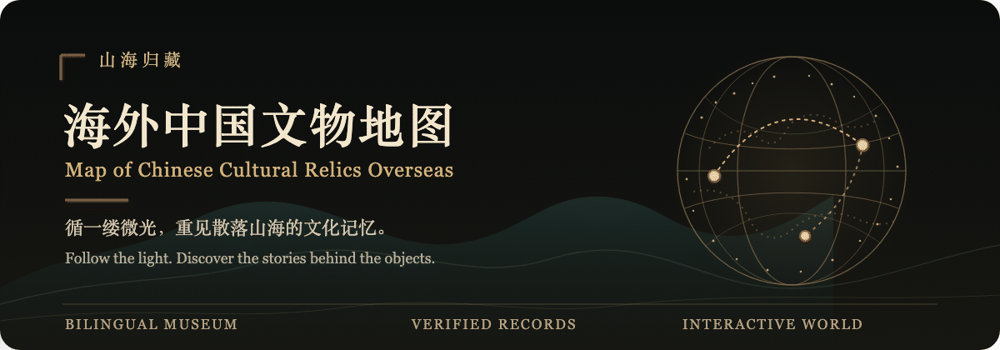

<p align="center"></p>

<p align="center"><a href="https://chinese-relics-overseas.summercommences.com/">在线参观 / Visit the museum</a> · <a href="./assets/readme/hero.svg">静态 SVG / Static hero</a></p>

# 海外中国文物地图 / Map of Chinese Cultural Relics Overseas

以 React + Three.js 构建的中英双语响应式虚拟博物馆。第一阶段收录 20 条馆藏记录；当前仓库已扩充至 57 条、13 家海外馆藏机构，并在可旋转地球上连接“现藏地”和有证据支持的“故乡”。[网站已上线](https://chinese-relics-overseas.summercommences.com/)；线上内容以最后一次成功部署为准。文物资料与图像权利核验仍将继续。

A bilingual, responsive React + Three.js virtual museum. Phase I began with 20 records; the repository now contains 57 records across 13 museums. A rotating globe connects current collections to documented places of origin. The [website is live](https://chinese-relics-overseas.summercommences.com/); its content reflects the latest successful deployment. Research and image-rights review continue.

## 发布范围 / Publication scope

本目录是**当前博物馆版本的独立仓库**。只把本目录作为 GitHub 仓库根目录；不要上传其上级工作目录。未收录旧项目首页、旧预览、嵌套旧仓库、生成的构建产物或本机配置。`index.html` 与 `museum.html` 均进入当前博物馆落地页。图片优先采用逐件核验的开放替代图；仍无合适图片时保留馆藏记录和占位，详见 `ATTRIBUTIONS.md` 与 `MUSEUM-SOURCES.md`。

This directory is the standalone repository for the current museum. Use **this directory only** as the GitHub repository root, not its parent workspace. Older pages, previews, build output and local configuration are excluded. Both `index.html` and `museum.html` open the museum landing page. Object-matched reusable images are preferred; records without a suitable image remain visible with placeholders. See the attribution and source notes.

## 本地运行

```bash
npm ci
npm run dev
```

生产构建：

```bash
npm run build
npm run preview
```

构建结果位于 `dist/`。构建脚本会从产物中移除 `.gitignore` 明列的 `public/` 本地自摄照片与已停用/待清权文件；部署前仍应检查最终产物。项目使用相对资源路径，可部署在根域名或子路径。

## 交互与技术方案

- React 负责双语、检索、分类筛选、博物馆/文物切换与响应式详情面板。
- Three.js 按 Natural Earth 国界数据渲染粒子地球、国家轮廓、准确经纬度点位与有证据支持的故乡弧线。
- 地球以低饱和金色粒子呈现；青绿山水为原创程序化意境演绎，不是馆方原画扫描。
- 已核实可再分发的文物图片本地化，逐件展示摄影者、许可和原始文件页；目前 57 条记录中 55 条有图片，另外 2 条显示占位并链接馆方原页。
- Three.js 独立懒加载；小红书 User-Agent 和“减少动态效果”系统设置默认进入省流模式，用户仍可手动切换 3D。

## 部署 / Deployment

线上入口：[chinese-relics-overseas.summercommences.com](https://chinese-relics-overseas.summercommences.com/)。当前使用 Cloudflare Workers 静态资源部署，`wrangler.jsonc` 对应现有 Worker，资源目录为 `dist/`。在该 Worker 的 Settings → Build 中，将 Build command 设为 `npm run build`、Deploy command 设为 `npx wrangler deploy`，并使用 Node 22 或更新版本。部署前须检查构建产物；Git 推送只有在 Workers 构建成功后才会更新线上网站。

Live site: [chinese-relics-overseas.summercommences.com](https://chinese-relics-overseas.summercommences.com/). The site uses Cloudflare Workers Static Assets. `wrangler.jsonc` targets the existing Worker and serves `dist/`. In that Worker's Settings → Build, set the Build command to `npm run build` and Deploy command to `npx wrangler deploy`, using Node 22 or newer. Inspect the build output before deployment; a Git push updates the live site only after the Workers build succeeds.

无论哪种平台，**只部署由本仓库清洁构建得到的 `dist/`**，不要上传其他项目的工作目录或旧的本地产物。图片替换后需复核署名、许可和最终构建文件；六张自摄照仍不公开。

Whichever platform is used, **deploy only a clean `dist/` built from this repository**, never the parent workspace or an older local build. Recheck credits, rights, and final files after image changes; the six creator-shot photos remain unpublished.

本次新增的 favicon 与分享缩略图需要随下一次构建一起发布。发布后请确认 `/favicon-32.png` 和 `/og-shanhai.png` 分别返回 PNG 图片，而非站点的 HTML 回退页面；若分享卡片仍显示旧图，需在对应平台重新抓取链接。

The favicon and social preview image go live with the next build. After deployment, verify that `/favicon-32.png` and `/og-shanhai.png` return PNG images rather than the site's HTML fallback. Social platforms may cache an older card until the link is re-scraped.

## 小红书小程序 / 小组件上线（重要）

本仓库可直接上线为网站/H5，但**不能把 React/Vite 的 `dist/` 直接当作小红书小程序代码包上传**。按小红书 2026 年官方文档，小程序需使用小红书开发者工具单独开发；小组件页面采用 `XHSML + CSS + JS`，或基于 Taro / uni 等框架配置小红书平台插件迁移。平台当前还限制单个代码包上限为 2 MB。

推荐采用“双端”方案：

1. 将本项目部署在 Vercel / Cloudflare，作为完整 3D 官网和小红书站外分享落地页。
2. 第二阶段建立 Taro 或原生 XHSML 小组件：复用 `src/data.js` 的数据与视觉规范，首屏使用轻量 2D 地图；Three.js 3D 只在平台能力与真机测试允许时启用。
3. 在小红书开放平台完成主体认证、类目选择与工信部备案，在官方 IDE 生成 `project.config.json` 后上传代码、提交发版审核。
4. 在 iOS、Android 小红书客户端真机测试；官方文档说明两端渲染与脚本环境不同，开发者工具结果不能代替真机结果。
5. 准备应用图标、9:16 封面与录屏、隐私政策、内容来源说明和图片授权/署名清单。正式商业使用前，逐一确认非公有领域图片的授权范围。

官方入口与依据：[小红书小程序介绍](https://miniapp.xiaohongshu.com/doc/DC137160)、[小组件项目结构](https://miniapp.xiaohongshu.com/doc/DC923374)、[小组件运行环境](https://miniapp.xiaohongshu.com/doc/DC096131)。

## 数据与版权

馆藏数据分列于 `src/data.js`、`src/museum/expanded-data.js` 与 `src/museum/supplemental-data.js`，保留馆方原始记录链接、馆藏编号、图像署名和不确定性说明。文物图片具有不同许可，不能把整个 `public/art/` 目录视作统一开源；详见 `ATTRIBUTIONS.md`。

## 许可与自摄照片 / License and own photographs

`LICENSE` 将本项目原创软件代码置于 [PolyForm Noncommercial 1.0.0](https://polyformproject.org/licenses/noncommercial/1.0.0) 条款下：允许非商业使用、修改和再分发；**商业项目使用代码须另获权利人许可**。这是附有非商业条件的源码许可，不属于 OSI 意义上的开源许可。馆藏照片、其他视觉素材、馆方资料与嵌入的编辑文字不受该代码许可覆盖，逐项权利见 `ATTRIBUTIONS.md`。

项目作者自摄的南海观音、皇后礼佛图、飒露紫、拳毛騧、皇家安大略博物馆《弥勒净土变》及《朝元图》东壁照片保留所有权利，未采用 CC 开放许可。六个本地副本已写入 `.gitignore`，不得提交，也不再被页面调用。忽略源文件只能避免仓库克隆直接取得照片；**若未来网站公开显示自摄照，访客仍能从网页请求或截图获得显示版本**。原先使用六张自摄照与八张待清权继承照的 14 条馆藏记录现已改用 Commons 开放替代图，逐件署名和许可见 `ATTRIBUTIONS.md`。旧照及来源待核的旧地球纹理仍不纳入公开仓库；构建脚本还会将其从 `dist/` 移除。旧本地产物可能仍含排除项，部署前须重新构建并检查。目前仅波士顿罗汉与 V&A 宜兴茶壶两条记录显示占位。

宾大两张是普通游客在无禁拍标识区域拍摄，本站不售卖图片。纳尔逊两张照片也并非商业或专业摄影；但为避免把“允许游客拍照”误认为“明确允许公开作品集展示”，本站谨慎地在取得馆方书面确认前不随公开网站发布这两张照片。皇家安大略博物馆的[访客摄影规则](https://www.rom.on.ca/visit/visitor-information)限定个人用途，两张新照片亦暂不公开。不要把馆方可下载图片的使用条件套用到自摄照片；若改用馆方图片，应另按其条款逐张处理。

The PolyForm Noncommercial 1.0.0 terms linked in `LICENSE` cover original software code only. Noncommercial use, modification and distribution are permitted; commercial use requires separate permission. This is source-available, not OSI open source. Photographs, other visuals, museum records, and embedded editorial text retain separate rights. The six creator-shot museum photographs remain all rights reserved, Git-ignored, and unused by the site. Fourteen formerly unillustrated records now use individually verified Commons alternatives with photographer, file-page and licence credits; two records still use placeholders. Older uncleared images and an inherited earth texture remain excluded. Keeping a photo out of Git does not prevent saving an image shown on a public website. The build strips explicitly ignored public assets from `dist/`; rebuild and inspect before deploying. If an open substitute cannot be found later, review the venue's rules before considering a metadata-stripped creator-shot version.
